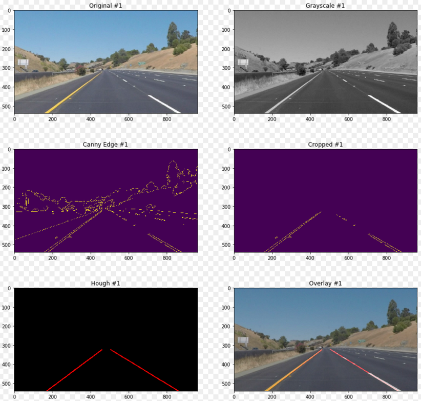

# **Finding Lane Lines on the Road** 

### by Ciaran Murphy

---

**Finding Lane Lines on the Road**

The goals / steps of this project are the following:
* Make a pipeline that finds lane lines on the road
* Reflect on your work in a written report

[//]: # (Image References)

---

### Reflection

My pipeline consists of the following steps:

 1. **Convert to Grayscale** 
 
 Converting the image to grayscale removes all color which makes later steps in
 the pipeline easier. For example, instead of being concerned with both white
 and yellow lane lines, in grayscale we only need to consider shades from white
 to black. Converting is a simple line of code to call the `cv2.cvtColor(img,
 cv2.COLOR_RGB2GRAY)` api from OpenCV.

 2. **Apply Gaussian Blur** 
 
 Applying Gaussian smoothing has the affect of reducing noise from the image
 while leaving the signal data intact. This is required in particular for Canny
 Edge detection.

 3. **Apply Canny Edge Detection** 
 
 Canny filtering look at the areas in the image where the rate of change
 between points is high. It outputs an image of dots that represent the edges
 of objects in scenes. 

 4. **Crop the image** 
 
 The nest step is to crop the image to an area where we can reasonably expect
 to find lane lines. The simple representation is a triangle that covers the
 entirety of the bottom of the image and extends upwards to the middle.

 5. **Hough Transform** 
 
 Hough transform takes the cropped, canny edge image and converts the dots into
 lines. This is done by 1st converting the image to Hough space, dividing the
 image into a grid and searching for sections of the grid where there are
 a high number of dots. Since lines are converted to dots in Hough space, and
 (more importantly), dots are converted to lines, this algorithm can be used to
 convert the dots from the Canny image to actual lines like we would expect. 

 6. **Line Joining and Extension** 
 
 The final step in the pipeline is to join the line fragments together to leave
 us with a single line for the left lane marker and a single line for the right
 lane marker. Both lines extend from the bottom of the image to a fixed
 distance towards the center. 

 To join and extend the lines, I modified the `draw_lines()` method to store
 the vertical size of the image. We will always want the left and right
 y values to be this number since the lane lines should always extend to the
 bottom of the image. We can also make a decision about the y values to the top
 of the image since this will also be a fixed value (the limit of the horizon
 of the cropped area from stage 4 of the pipeline for example).
 
 The trickier part is what to do with the x values. Our task is to extrapolate
 the lines that are part of the left lane line outwards to the left lane
 limits, and to do likewise with the lines detected that correspond to the
 right lane line. So we must 1st separate all the detected lines into 'left
 bucket' and 'right bucket'. This can be accomplished by calculating the slope
 of each line and testing for whether it is greater or less than zero (slope
 can be calculated using `slope = ((y2-y1)/(x2-x1))`). Since in the image
 coordinates system, y actually grows down from the top (unlike normal
 mathematical plots), lines that have a slope > 0 are slanting downwards
 visually and must be part of the right lane line. Similarly, lines with
 a slope < 0 are part of the left lane line. Once these buckets have been
 created, the next step is to leverage Numpy's `poly1d()` and `polyfit()` apis
 to fit the lines into the min/max y values described earlier.
 
 Incidentally, a simple check to see if the slope is too steep is a good way to
 filter out noise from the system. The lane lines should never be too steep,
 even in a sharp bend for example. Therefore any value that is too high is
 likely noise and can be discarded.
 
Below is an example of all the major stages in the pipeline with the original
image visible at the top left.

### 2. Identify potential shortcomings with your current pipeline

The pipeline is not good at handling sharp corners as there is not really any
accommodation for non-straight lane lines. 

Another limitation is that when the lane markings are very broken, it can lead
to problems. I had to spend a lot of time fine tuning the parameters to prevent
the line detection finding nothing at all in some of the video frames for
example. 

It is also a very static model - there is no mechanism to adjust to changing
conditions on the road, like for example transitioning from a cement road to
tarmac or entering a tunnel for example. Such transitions are likely to cause
erratic predictions.

### 3. Suggest possible improvements to your pipeline

One improvement that would need to be made would be to add some elasticity to
the system to handle bends in the road and/or other factors like steep hills
either traveling up or down. There are likely good mathematical models that
could be leveraged for this so that instead of extending in a straight line, we
could extend around a probable corner. I would anticipate that there are limits
to how far this can be taken though and would be surprised if it were not also
necessary to dynamically change the cropping area based on conditions (meaning
shrink the area and grow it based on factors like the curvature of the lane
markings).

Another improvement could be to add error correction and smoothing to combat
noise that escapes into the system producing sudden changes in prediction
lines. For example, if the slope of a lane line were to change very rapidly
between frames, more than would be considered possible by a reasonable
person, this would be a sign of noise in the system. A smoothing/probability 
function could then be employed to paint the 'correct' lane line instead for 
that frame.

Finally, it might be the case that using a simple triangle shape for the
cropping area could be improved upon. For example a trapezoid might produce
better results for certain conditions, but may also suffer from needing it's
top corners adjusted depending on road and lighting conditions. 

### Feedback: 

For challenge video, I suggest to experiment with HLS or HSV color space to
detect white and yellow pixels in the image.  There are ways to draw the lanes
other than using slopes. For example, you can warp the image(bird eye view) and
then assume that the left side contains the left lane pixels and right half of
the image contains the pixels for right lanes. These pixels can be stored and
polyfit method can be used to fit a line. polyfit method can also be used to
fit a curve which would be helpful for the curving roads. The search area in
the image for right and left lanes can be narrowed down after achieving some
confidence about the location of lane pixels in the image. It helps in speeding
up the process of detecting lanes.

For smoother results, you can save the lanes from the previous n frames and use
those with the lanes from current frame. It also helps in cases where lanes is
not detected at all.

This research paper http://airccj.org/CSCP/vol5/csit53211.pdf goes into how to
detect curves and will also help in detecting faded lanes. It uses an extended
version of hough lines algorithm to detect tangents to the curve which can 
help you detect the curve.

